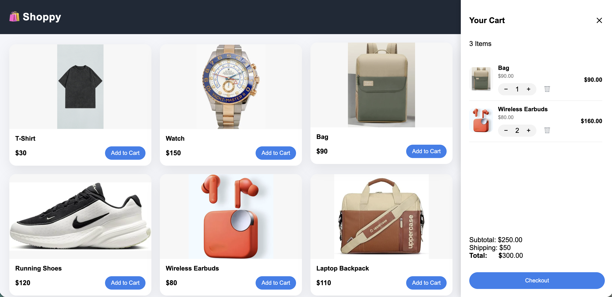

# 🛒 Shoppy – Shopping Cart Application

A simple shopping cart web application built using **pure JavaScript**, **HTML**, and **CSS**.  
The project demonstrates clean architecture, state management, and dynamic UI updates without using any frameworks.

---

## 🔗 Live Demo

👉 **Live URL:** https://kriyo-assignment.onrender.com

---

## 📌 Features

- Display list of products with image, name, and price
- Add products to cart
- Increase / decrease item quantity
- Remove items from cart
- Dynamic cart count badge
- Real-time subtotal and total calculation
- Scrollable cart panel
- Cart opens and closes on click
- Clean and responsive UI
- No external libraries or frameworks used

---

## 🧱 Tech Stack

- **HTML5**
- **CSS3**
- **Vanilla JavaScript (ES Modules)**

---

## 📂 Project Structure


```text
.
├── index.html
├── css/
│   └── style.css
├── js/
│   ├── app.js
│   ├── data.js
│   ├── store.js
│   └── ui.js
└── assets/
    └── (product images)
```


## 🧠 Architecture Overview

- **data.js**  
  Contains product data (name, price, image).

- **store.js**  
  Handles cart state and updates using a simple state-management pattern.

- **ui.js**  
  Responsible for rendering products and cart UI.

- **app.js**  
  Acts as the controller that connects data, state, UI, and user interactions.

The application follows **separation of concerns** and **unidirectional data flow**.

---

## 🚀 How It Works

1. Products are rendered dynamically on page load.
2. Clicking **Add to Cart** updates the cart state.
3. Cart UI automatically re-renders on state change.
4. Cart panel visibility is controlled separately for better UX.
5. Totals and item counts update in real time.

---

## 🖥️ Run Locally

```bash
git clone https://github.com/sambangiadharsh/Kriyo-assignment.git
cd Kriyo-assignment


## 📸 Screenshots



